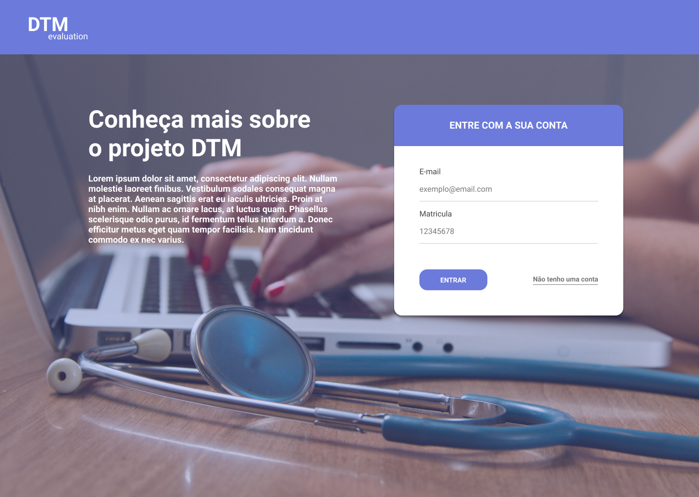
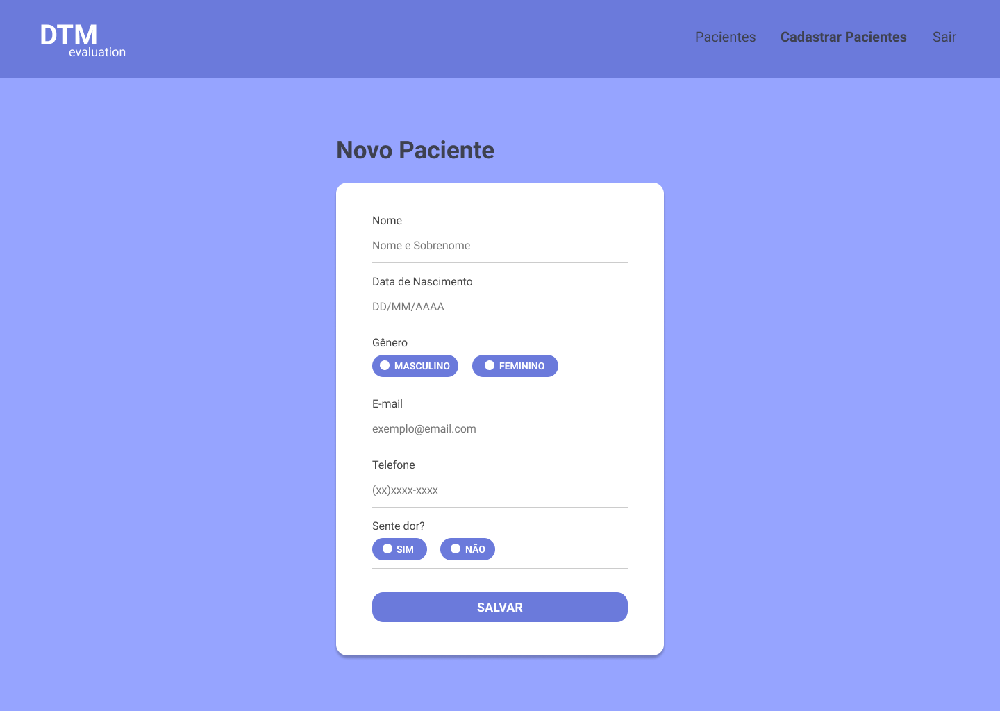

## Sobre o Projeto

Este projeto foi desenvolvido com o intuito de medir a disfunção temporomandibular, utlizando um script em python para fazer tal medição, junto de uma interface web para que médicos possam ter acesso aos dados gerados por cada paciente.

## Tecnologias utilizadas

O projeto foi desenvolvido utilizando:

- Python
- Flask
- HTML5 e CSS3

## 🎨 Design

## Requisitos

- Python 3.6 ou maior
- PostgresSQL
- Git

## 📥 Executar esse projeto no seu computador

Para rodar o projeto, siga os passos abaixo:

1 - Clone o Repositório: `git clone https://github.com/rnanc/dtm-evaluation.git`

2 - Entre na pasta do projeto e execute o comando `pip install -r requirements.txt`

3 - Após ìsso, crie o banco de dados local com os seguintes comandos:

Comando 1:

`flask db init`

Comando 2:

`flask db migrate`

Comando 3:

`flask db upgrade

4 - Depois de criar o banco, execute o comando `flask run`

