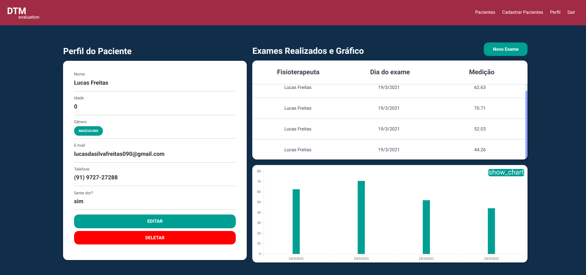
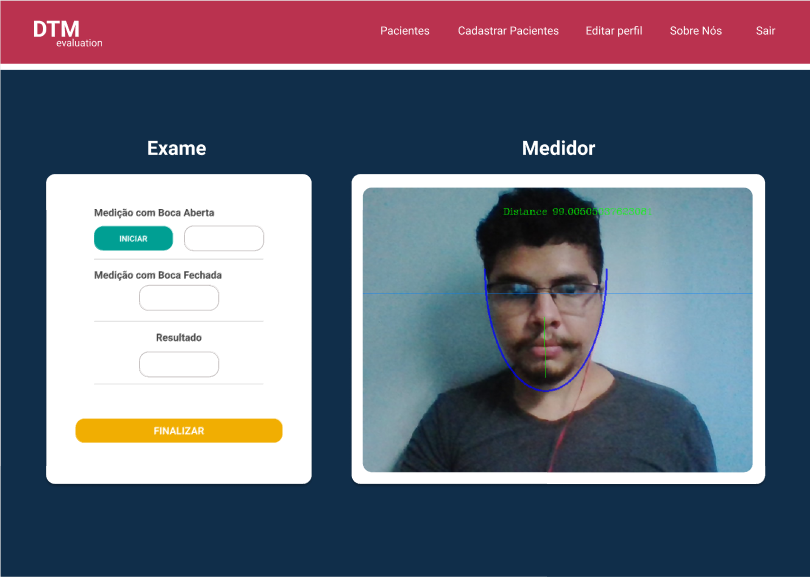
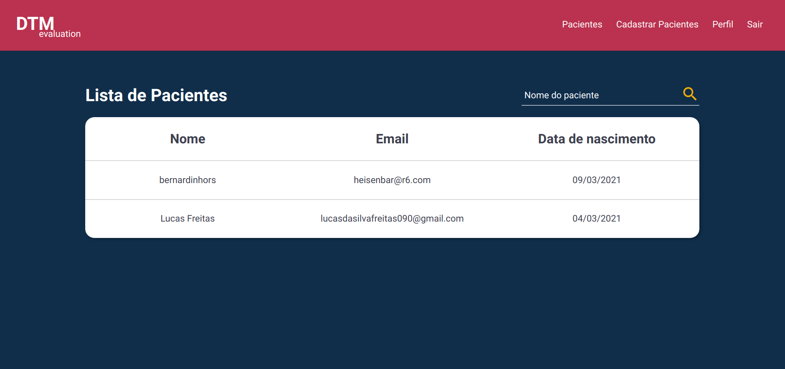

## 🎨 Design

## Sobre o Projeto

Este projeto foi desenvolvido com o intuito de servir como uma alternativa avaliativa para tratamento e acompanhamento de pacientes sintomáticos de DTM (Disfunção Temporomandibular), utlizando um script em python para auxiliar o tratamento, junto de uma interface web para que médicos possam ter acesso aos dados gerados por cada paciente.

## Tecnologias utilizadas

O projeto foi desenvolvido utilizando:

- Python
- Flask
- HTML5 e CSS3

## Requisitos

- Python 3.6 ou maior
- PostgresSQL
- Git

## 📥 Executar esse projeto no seu computador

Para rodar o projeto, siga os passos abaixo:

1 - Clone o Repositório: `$ git clone https://github.com/rnanc/dtm-evaluation.git`

2 - Entre na pasta do projeto e execute o comando `$ pip install -r requirements.txt`

3 - Após ìsso, crie o banco de dados local com os seguintes comandos:

Comando 1:

`$ flask db init`

Comando 2:

`$ flask db migrate`

Comando 3:

`$ flask db upgrade`

4 - Depois de criar o banco, execute o comando `$ flask run`

